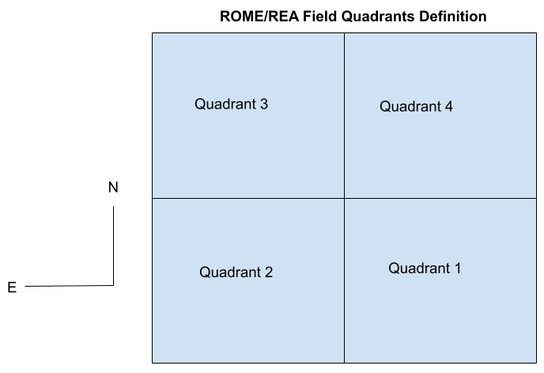

# romerea_toolkit

This repository provides a set of Python-based software tools for handling data from the 
ROME/REA microlensing survey.  

# pyDANDIA Photometric Data Products

## Key terms used
**Dataset:** A set of images taken of the same pointing in the sky, normally with a single camera and filter in a consistent configuration.  pyDANDIA is designed to reduce each dataset independently.

**Field:** A sky pointing, the footprint of an instrument on sky at a given RA, Dec

**Field data:** Data products combining the photometry from multiple datasets of the same sky pointing.  These can be from multiple cameras and filters.

**Dataset star catalog:** A list of objects detected in the reference image for each dataset, and stored in the metadata file.  IMPORTANT: Since datasets are processed independently, the star catalog for each dataset is also independent.  

The distinct star catalogs for each dataset means that the pipeline can be very flexible about processing data from different fields and instruments, but it means that the ID number of a star in one dataset does not automatically correspond to the same ID in a different dataset, even if they are of the same point in the sky.  

In order to combine the photometry from different datasets of the same field, pyDANDIA includes functions that cross-match stars between different datasets of the same field, including those taken by different instruments and with different files.  These functions produce the field data products, which include an overall catalog of all objects detected in all datasets.  

# Field Data Products
By the nature of the ROME/REA survey, multiple datasets were produced for each field, and then 
later combined into a single set of data products which are easier and faster to handle.  
Tools are included in this repository for this purpose. 

It was found that combining all the timeseries photometry for all datasets for a single ROME 
field would produce a file that was larger than a typical desktop machine could easily handle.  
Instead, each field is divided into quadrants by RA, Dec, with each star being assigned to a 
given quadrant according to it’s position.  The timeseries photometry is therefore split into 
four files.



## The Field Crossmatch File
Format: Multi-extension FITS binary tables

Software to handle I/O: crossmatch.py

Naming convention: <field name>_field_crossmatch.fits 

Short video introduction to the crossmatch file

Short video describing how to use the crossmatch tables in Python

This file provides the combined star catalog for the whole field, including all objects detected in all datasets.  Since the combined star catalog - called the field index -  is always more complete than that for an individual dataset, this is considered to be the definitive catalog for the field, and it provides a unique star ID index for each object.  Each crossmatch file contains the following tables:
Field Index: Unique identifiers for all objects detected in all datasets, their RA and Dec, and the corresponding index of each object in the star_catalog (in the metadata files) of all the datasets where it was detected.  A zero-entry in the dataset index columns indicates no detection of the object in that dataset.  The field index also lists which quadrant a star is assigned to, and the index of the star in that quadrant.  This data is used to identify which timeseries photometry file contains the star’s lightcurve data, and at which index in that file.  
Datasets table: A table of all the datasets used to build the combined field data products.  
Stars table: A table of the calibrated reference image photometry for all stars from all datasets, together with any Gaia data matching that star.  Currently, the Gaia data release used is Gaia-EDR3.  This table allows colour-magnitude analysis based on data from any site, and selection based on Gaia parameters.  
Images table: A table of all images in all datasets, including information on the filter and HJD.  Note that the HJD entry can be zero, if no photometry was produced from the image.
Stamps table: A table describing the dimensions and transformation parameters of the sub-image stamps used in the reduction.  

## The Quadrant Timeseries Photometry Files
Format: HDF5

Software to handle I/O: hd5_utils.py

Naming convention: <field_name>_quad{1,2,3,4}_photometry.hdf5

Short video describing how to use the timeseries photometry files

Each quadrant’s timeseries photometry file is in the form of an array (n_stars, n_images, 7 columns), where the columns are:
```
Column 1: hjd
Column 2: instrumental_mag
Column 3: instrumental_mag_err
Column 4: calibrated_mag
Column 5: calibrated_mag_err
Column 6: corrected_mag
Column 7: corrected_mag_err
Column 8: normalized_mag
Column 9: normalized_mag_err
Column 10: phot_scale_factor
Column 11: phot_scale_factor_err
Column 12: stamp_index
Column 13: sub_image_sky_bkgd
Column 14: sub_image_sky_bkgd_err
Column 15: residual_x
Column 16: residual_y
Column 17: qc_flag
```

Note that the qc_flag column uses a bitmap to represent the following data quality states:
0 No error; data point good

1 No valid photometric measurement possible by stage 6

2 Image photometry displayed excessive photometric scatter (usually the result of bad seeing or transparency)

4 Data point failed phot scale factor / exposure time metric

8 Low quality image resampling

16 Difference image exhibited high residuals. 

The ultimate state of the qc_flag is the sum of all of the above tests, meaning that datapoints with multiple issues can have qc_flag values exceeding 16.  A selection cut of qc_flag=0 should be applied to extract datapoints believed to be of good quality based on the automated checks.  

Note that the corrected_mag columns are not yet populated but have been included to allow for the results of post-processing.  

The timeseries photometry for a given star can be extracted as follows:
Identify the star’s entry in the Field Index ID based on its RA, Dec.  This will tell you the quadrant that the star lies in as well as the ID of the star in that quadrant.  
The quadrant number tells you which of the field quadrant HDF5 files to use to extract the timeseries photometry of the star.
The star’s quadrant ID tells you the identifier of the star in the data for that quadrant.  The star’s array index in the HDF5 file = star quadrant ID - 1


## Using the Field Data Products - Example: OGLE-2019-BLG-0011 in ROME-FIELD-01
This star’s Field ID = 78284.   Using TopCat to look up this field_id in the Field Index for ROME-FIELD-01 (in the field crossmatch file for the field) shows that this star is in quadrant 3, with a quadrant_id = 42463.  The star’s photometry can therefore be found in the ROME-FIELD-01_quad3_photometry.hdf5 file, at array index 42462.  

The pipeline (on branch ROME_DR1) includes a convenience function for reading the HDF5 files directly:
```
python> from pyDANDIA import hd5_utils    
python> file_path = '/Users/rstreet1/ROMEREA/ROME-FIELD-01/DR1/ROME-FIELD-01_quad3_photometry.hdf5'
python> phot_data = hd5_utils.read_phot_from_hd5_file(file_path)
python> phot_data                                                                                                           
Out[4]: <HDF5 dataset "dataset_photometry": shape (99481, 2214, 7), type "<f8">
```

The returned HDF5 array, phot_data, is a 3D array where the first axis corresponds to the star array index - the array is dimensioned according to (n_stars, n_images, 7 data columns).  
The timeseries photometry for our example star can be extracted using the array index we identified earlier:
```python> phot_data[42462,:,:]                                                                                                
Out[5]: 
array([[2.45864579e+06, 1.89475466e+01, 6.98264037e-03, ...,
        6.98264037e-03, 0.00000000e+00, 0.00000000e+00],
       [2.45855288e+06, 1.85088922e+01, 3.12409736e-03, ...,
        3.12409736e-03, 0.00000000e+00, 0.00000000e+00],
       [2.45864569e+06, 1.89178171e+01, 4.81937760e-03, ...,
        4.81937760e-03, 0.00000000e+00, 0.00000000e+00],
       ...,
       [2.45833435e+06, 2.08830200e+01, 5.13470543e-02, ...,
        5.13470543e-02, 0.00000000e+00, 0.00000000e+00],
       [2.45836622e+06, 2.07022669e+01, 4.25343826e-02, ...,
        4.25343826e-02, 0.00000000e+00, 0.00000000e+00],
       [2.45839223e+06, 2.07968481e+01, 3.91556159e-02, ...,
        3.91556159e-02, 0.00000000e+00, 0.00000000e+00]])
```

The resulting array contains all 7 columns of photometry measurements for all images, combined from all datasets.  

Having extracted these data, it’s often useful to select the images from different datasets, or filters.  This can be done using the information in the Images table of the field crossmatch file.  

First, load the data from the crossmatch file, to access the data in the Images table.  The pipeline’s built-in functions will return it in the form of an Astropy table.  
```
python> from pyDANDIA import crossmatch
python> import numpy as np
python> file = '/Users/rstreet1/ROMEREA/ROME-FIELD-01/DR1/ROME-FIELD-01_field_crossmatch.fits'
python> xmatch = crossmatch.CrossMatchTable() 
python> xmatch.load(file)    
python> xmatch.images                                                                                                       
Out[7]: 
<Table length=2214>
index               filename               ...      skew_diff           kurtosis_diff     
int64                str80                 ...       float64               float64        
----- ------------------------------------ ... -------------------- ----------------------
    0 lsc1m005-fa15-20190610-0205-e91.fits ...    6.172574787633106   9.88518365653761e-09
    1 lsc1m005-fa15-20190309-0220-e91.fits ... -0.03582948547777698 1.1109174691900272e-08
    2 lsc1m005-fa15-20190610-0183-e91.fits ...     7.67133980818663  9.202312487729357e-09
    3 lsc1m005-fa15-20190312-0280-e91.fits ...                 -1.0                   -1.0
    4 lsc1m005-fa15-20190612-0218-e91.fits ...   1.4212038807828278  1.061836112057911e-08
    5 lsc1m005-fa15-20190316-0251-e91.fits ...                 -1.0                   -1.0
    6 lsc1m005-fa15-20190618-0266-e91.fits ...   12.997994776806312   9.79885564200768e-09
    7 lsc1m005-fa15-20190319-0260-e91.fits ...   -5.261900240206232 1.0685747233088825e-08
    8 lsc1m005-fa15-20190619-0181-e91.fits ...                 -1.0                   -1.0
    9 lsc1m005-fa15-20190330-0112-e91.fits ...                 -1.0                   -1.0
  ...                                  ... ...                  ...                    ...
 2204 cpt1m012-fl06-20180327-0192-e91.fits ...  -3.5309020577888686 1.0980348361199079e-07
 2205 cpt1m012-fl06-20180414-0210-e91.fits ...   -1.851875780507223  7.891536942411268e-08
 2206 cpt1m012-fl06-20180415-0172-e91.fits ...   2.8756970780309272  9.924391947899972e-08
 2207 cpt1m012-fl06-20180420-0175-e91.fits ...   -13.35277819208455 1.2849964431229522e-07
 2208 cpt1m012-fl06-20180421-0257-e91.fits ...  -1.6110921854062359  1.259610482578831e-07
 2209 cpt1m012-fl06-20180422-0156-e91.fits ...   18.758506993179125  8.343153819971174e-08
 2210 cpt1m012-fl06-20180802-0048-e91.fits ...  -13.366385616870218  1.102185095957245e-07
 2211 cpt1m012-fl06-20180803-0087-e91.fits ...  -13.842835570880986  8.641233122074814e-08
 2212 cpt1m012-fl06-20180904-0055-e91.fits ... -0.35592983529719235 1.1303885531351557e-07
 2213 cpt1m012-fl06-20180930-0048-e91.fits ...  0.07069439002681724 1.0074763327856092e-07
```

This table includes the filter used for each image in the dataset, so we can extract an index of all the images for a particular filter using NumPy’s where function:
```
python> idx = np.where(xmatch.images['filter'] == 'ip')[0]
python> print(idx)                                                                                                                
Out[10]: array([   0,    1,    2, ..., 2201, 2202, 2203])
```

The order of images in the Images table is reflected in the array order for the timeseries photometry, so that the data for image index 0 in the Images table can be found at array entry 0 in the second dimension of the HDF5 array.  So continuing the example above, we can now use idx to extract the photometry for all the i-band images for our example star:
```
python> print(phot_data[42462,idx,:])
array([[2.45864579e+06, 1.89475466e+01, 6.98264037e-03, ...,
        6.98264037e-03, 0.00000000e+00, 0.00000000e+00],
       [2.45855288e+06, 1.85088922e+01, 3.12409736e-03, ...,
        3.12409736e-03, 0.00000000e+00, 0.00000000e+00],
       [2.45864569e+06, 1.89178171e+01, 4.81937760e-03, ...,
        4.81937760e-03, 0.00000000e+00, 0.00000000e+00],
       ...,
       [2.45835935e+06, 1.91052976e+01, 7.54770821e-03, ...,
        7.54770821e-03, 0.00000000e+00, 0.00000000e+00],
       [2.45836623e+06, 1.90904923e+01, 8.44822309e-03, ...,
        8.44822309e-03, 0.00000000e+00, 0.00000000e+00],
       [2.45839224e+06, 1.90973357e+01, 7.25659342e-03, ...,
        7.25659342e-03, 0.00000000e+00, 0.00000000e+00]])
```
